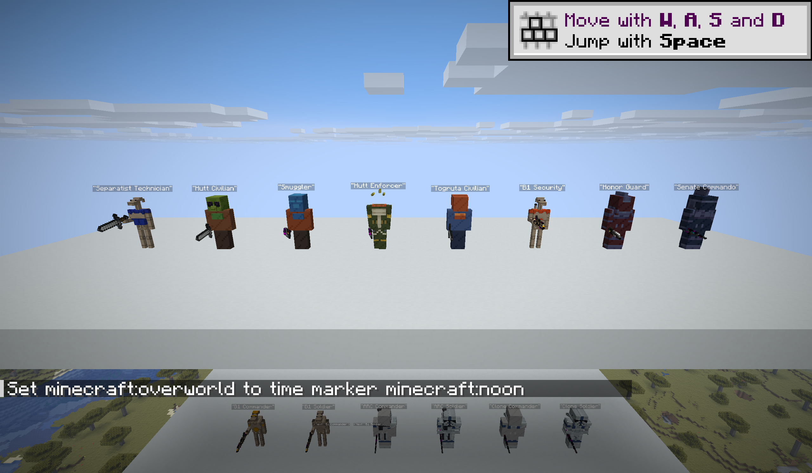
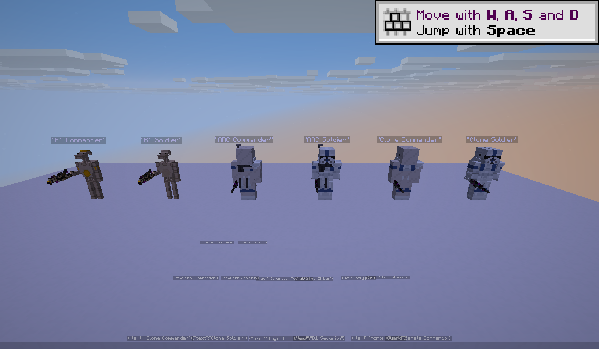
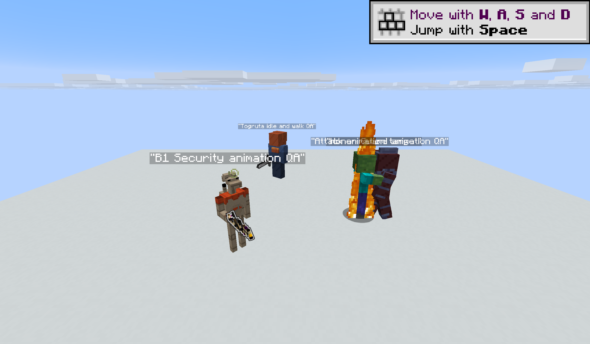

# PR #26 client visual QA

Date: 2026-07-21
Client: Minecraft NeoForge 26.2, singleplayer creative test world
Branch: `codex/curated-npc-droid-assets`

The QA scenes were created with runtime-only functions under generated `build/`
resources. Those functions are intentionally not part of the mod. The images in
this directory are the tracked evidence from the real development client.

## Curated default NPCs

The labeled lineup covers all eight requested default mappings: Senate
Commando, Republic Honor Guard, B1 Security Droid, Togruta Civilian, Hutt
Enforcer using the Trandoshan visual, Smuggler using the Duros composite, Hutt
Civilian using the Rodian composite, and Separatist Technician using the B1
pilot visual. The pass confirmed visible head/neck placement, composite clothing
placement, opaque required faces, and held-item alignment for blasters and melee
weapons.

## Commander comparisons

The three labeled pairs show the entity-type keyed duty override for B1 Battle
Droid, ARC Trooper, and Phase II Clone Trooper. Each commander was spawned with
persisted `RecruitDuty: "commander"`; the soldier beside it used the absent-duty
fallback. Promotion, save/load persistence, demotion, and fallback behavior are
also covered by the `curated_npc_runtime_contracts` GameTest.

## Animation and held-item pass

The live scene ran without `NoAI`: the Togruta moved between idle and walk,
tracked nearby actors with its head, B1 Security navigated with the E-5 aligned
to its hand anchor, and the Honor Guard pursued and attacked a hostile target
with its vibroblade. Idle, walk, attack, head-look, and held-item rendering all
played without a missing geometry, texture, or animation placeholder.

## Client log result

The final client resource load reported `GeckoLib` loading 39 models and 39
animations. A post-render scan found no missing or failed `galacticwars` model,
texture, geometry, or animation resource. The log contains Minecraft's unrelated
`minecraft:builtin/entity` block-model warning and an early parse failure for a
temporary QA function; the function was corrected and successfully reloaded
before these captures.
